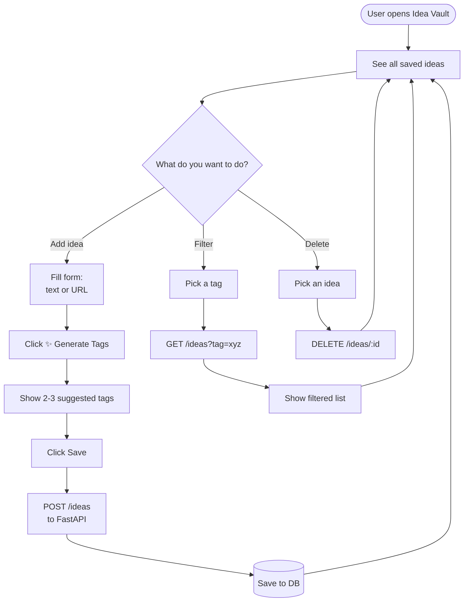
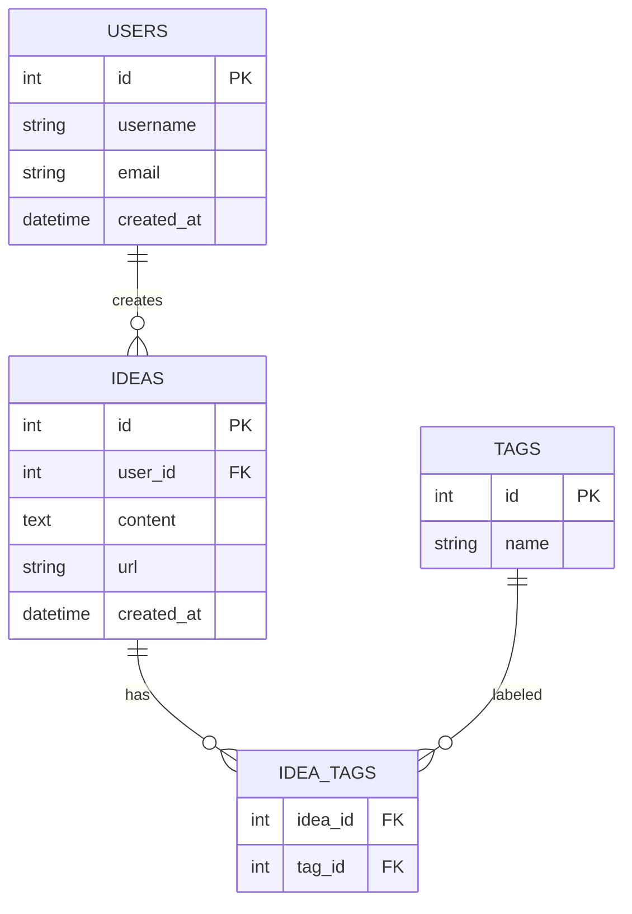
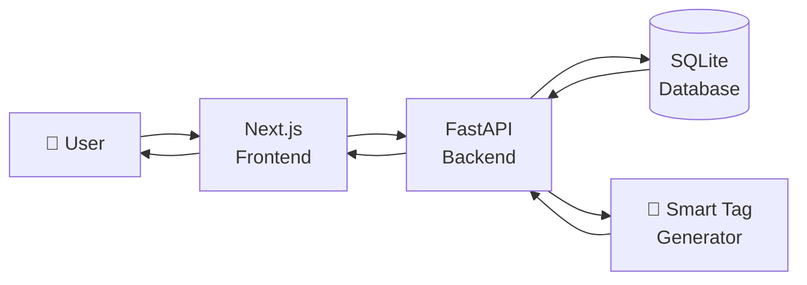

## 🔄 User Flow

```mermaid
flowchart TD
    Start([User opens Idea Vault]) --> ViewAll[See all saved ideas]
    ViewAll --> Choice{What do you want to do?}

    Choice -->|Add idea| AddForm[Fill form:<br/>text or URL]
    AddForm --> GenTags[Click ✨ Generate Tags]
    GenTags --> ShowTags[Show 2-3 suggested tags]
    ShowTags --> Save[Click Save]
    Save --> PostAPI[POST /ideas<br/>to FastAPI]
    PostAPI --> StoreDB[(Save to DB)]
    StoreDB --> ViewAll

    Choice -->|Filter| PickTag[Pick a tag]
    PickTag --> FilterAPI[GET /ideas?tag=xyz]
    FilterAPI --> ShowFiltered[Show filtered list]
    ShowFiltered --> ViewAll

    Choice -->|Delete| PickIdea[Pick an idea]
    PickIdea --> DelAPI[DELETE /ideas/:id]
    DelAPI --> ViewAll
```

---

## 🗄️ Database Schema

```mermaid
erDiagram
    USERS ||--o{ IDEAS : creates
    IDEAS ||--o{ IDEA_TAGS : has
    TAGS ||--o{ IDEA_TAGS : labeled

    USERS {
        int id PK
        string username
        string email
        datetime created_at
    }

    IDEAS {
        int id PK
        int user_id FK
        text content
        string url
        datetime created_at
    }

    TAGS {
        int id PK
        string name
    }

    IDEA_TAGS {
        int idea_id FK
        int tag_id FK
    }
```

---

## ⚡ Simple Linear Overview

```mermaid
flowchart LR
    A[👤 User] --> B[Next.js<br/>Frontend]
    B --> C[FastAPI<br/>Backend]
    C --> D[(SQLite<br/>Database)]
    C --> E[🤖 Smart Tag<br/>Generator]
    E --> C
    D --> C
    C --> B
    B --> A
```

---
